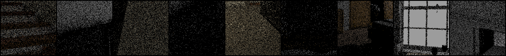
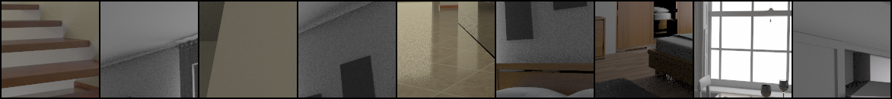
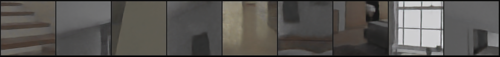

# Recurrent Denoising Autoencoder - PyTorch Lightning

A PyTorch Lightning implementation of [Interactive Reconstruction of Monte Carlo Image Sequences using a Recurrent Denoising Autoencoder](https://research.nvidia.com/publication/interactive-reconstruction-monte-carlo-image-sequences-using-recurrent-denoising)(2017), for study purposes. This repository is not official implementation. Also, some features in the original paper have not implemented (e.g., albedo demodulation).

My code was tested only for offline path traced images, while the paper aims to denoise at real-time rate.

## Prerequisites

- libopenexr-dev library
- openexr python package
    - You can install by `pip install openexr`, or, `conda install openexr-python` if you are using Anaconda.

## Usage

### Training

```shell
python train.py PATH_TO_DATASET --max_epochs MAX_EPOCHS --num_workers WORKERS
```

## Dataset structure

- For training, you have to prepare a dataset generated via Monte Carlo path tracing.
- Each input EXR file should contain 7 channels: R/G/B, depth, world-space shading normal x/y/z
- You can change input buffer definition by modifying the script.

```shell
Dataset root/
├─ train/
│  ├─ Scene A/
│  │  ├─ frame-0000/
│  │  │  ├─ target.exr (High-SPP target image)
│  │  │  ├─ noisy-0.exr (Input image by different random seeds)
│  │  │  ├─ noisy-1.exr
│  │  │  ├─ noisy-2.exr
│  │  │  ├─ noisy-3.exr
│  │  │  └─ noisy-4.exr
│  │  │   
│  │  ├─ frame-0001/
│  │  ├─ ...
│  │  └─ frame-####/
│  │
│  ├─ Scene B/
│  └─ ...
│
└─ test/
```


## Result of an initial experiment

### Training set
- 5 scene (bathroom, bedroom, kitchen, livingroom2, staircase2) from [Benedikt Bitterli's rendering resources](https://benedikt-bitterli.me/resources/)
- Avg. 183 frames per scene
- Input: 1-spp noisy RGB images(and 1500-spp G-Buffers) rendered by [Tungsten](https://github.com/tunabrain/tungsten)
- Target: 1500-spp images rendered by [Tungsten](https://github.com/tunabrain/tungsten)

### Input RGB



### Target



### Reconstructions (52 epochs)



## References

- Chakravarty R Alla Chaitanya, Anton S Kaplanyan, Christoph Schied, Marco Salvi, Aaron Lefohn, Derek Nowrouzezahrai, and Timo Aila. 2017. "Interactive reconstruction of Monte Carlo image sequences using a recurrent denoising autoencoder". ACM Transactions on Graphics (TOG) 36, 4 (2017), 1–12.